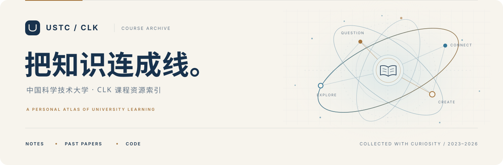

<a id="top"></a>

<picture>
  <source media="(prefers-color-scheme: dark)" srcset="docs/assets/cover-dark.svg">
  <source media="(prefers-color-scheme: light)" srcset="docs/assets/cover-light.svg">
  
</picture>

<h1 align="center">USTC CLK · 课程资源</h1>

<p align="center">
  一份按学期生长的学习档案。<br>
  <sub>笔记、历年资料、实验代码，以及一路积累的理解。</sub>
</p>

<p align="center">
  <a href="#course-catalog"><strong>课程目录</strong></a>&nbsp; · &nbsp;<a href="#usage">查阅指南</a>&nbsp; · &nbsp;<a href="#copyright">使用版权</a>&nbsp; · &nbsp;<a href="#contact">联系反馈</a>
</p>

<table align="center">
  <tr>
    <td align="center" width="320"><strong>06</strong><br><sub>收录学期</sub></td>
    <td align="center" width="320"><strong>38</strong><br><sub>课程记录</sub></td>
    <td align="center" width="320"><strong>2023—2026</strong><br><sub>资料覆盖时间</sub></td>
  </tr>
</table>

这里整理了我在中国科学技术大学学习期间积累的课程资料，希望为查阅知识、梳理思路和准备复习提供一个清晰的入口。

<a id="course-catalog"></a>

## 01 / 课程目录

资料通过 **Google Drive** 共享，按「**学期 → 课程 → 资料**」查阅。下方课程名用于索引，点击各学期的 **浏览资料 ↗** 进入对应文件夹。

**直达学年** &nbsp; [大一](#year-1) &nbsp; / &nbsp; [大二](#year-2) &nbsp; / &nbsp; [大三](#year-3)

<a id="year-1"></a>

### 大一 <sub> / 2023 — 2024</sub>

<table>
  <tr>
    <td width="480" valign="top">
      <a id="semester-1"></a>
      <h4>01 &nbsp; 大一上</h4>
      <p><sub>2023 秋季 · 1 项课程</sub></p>
      <ul>
        <li>微积分</li>
      </ul>
      <p><a href="https://drive.google.com/drive/folders/1QNdlliRIyVrIPTm4-vUbzF02G1hdH2Hd?usp=drive_link"><strong>浏览大一上资料 ↗</strong></a></p>
    </td>
    <td width="480" valign="top">
      <a id="semester-2"></a>
      <h4>02 &nbsp; 大一下</h4>
      <p><sub>2024 春季 · 5 项课程</sub></p>
      <ul>
        <li>力学 A</li>
        <li>分析化学</li>
        <li>线性代数 B</li>
        <li>大学生物理实验 B</li>
        <li>大学生英语</li>
      </ul>
      <p><a href="https://drive.google.com/drive/folders/1QNdlliRIyVrIPTm4-vUbzF02G1hdH2Hd?usp=drive_link"><strong>浏览大一下资料 ↗</strong></a></p>
    </td>
  </tr>
</table>

<sub>大一上与大一下沿用同一个共享文件夹入口，进入后请按课程名称查找。</sub>

<a id="year-2"></a>

### 大二 <sub> / 2024 — 2025</sub>

<table>
  <tr>
    <td width="480" valign="top">
      <a id="semester-3"></a>
      <h4>03 &nbsp; 大二上</h4>
      <p><sub>2024 秋季 · 7 项课程</sub></p>
      <ul>
        <li>复变函数</li>
        <li>数据结构及其算法</li>
        <li>概统</li>
        <li>电子技术基础</li>
        <li>电子技术基础实验</li>
        <li>电磁学 B</li>
        <li>计算系统概论 A</li>
      </ul>
      <p><a href="https://drive.google.com/drive/folders/1rKC24_2Wc0ouASy4hxDUV1DKTW6Pxvfz?usp=drive_link"><strong>浏览大二上资料 ↗</strong></a></p>
    </td>
    <td width="480" valign="top">
      <a id="semester-4"></a>
      <h4>04 &nbsp; 大二下</h4>
      <p><sub>2025 春季 · 9 项课程</sub></p>
      <ul>
        <li>信号与系统</li>
        <li>当我们讨论科学时</li>
        <li>数理方程</li>
        <li>机器人djy</li>
        <li>热学</li>
        <li>离散数学</li>
        <li>计算机原理与嵌入式系统</li>
        <li>量子物理</li>
        <li>随机过程</li>
      </ul>
      <p><a href="https://drive.google.com/drive/folders/1Qcu0L47VQelfRIyJ3qKE1QP-7RJ-G_3x?usp=drive_link"><strong>浏览大二下资料 ↗</strong></a></p>
    </td>
  </tr>
</table>

<a id="year-3"></a>

### 大三 <sub> / 2025 — 2026</sub>

<table>
  <tr>
    <td width="480" valign="top">
      <a id="semester-5"></a>
      <h4>05 &nbsp; 大三上</h4>
      <p><sub>2025 秋季 · 9 项课程</sub></p>
      <ul>
        <li>人工智能导论</li>
        <li>形势与政策</li>
        <li>数据库</li>
        <li>机器学习</li>
        <li>脑机接口</li>
        <li>脑认知科学导论</li>
        <li>计算机控制基础</li>
        <li>计算机网络</li>
        <li>语音</li>
      </ul>
      <p><a href="https://drive.google.com/drive/folders/1F0kJ3VBsrZfXz_ADZsk2NakCHg6VGHqX?usp=drive_link"><strong>浏览大三上资料 ↗</strong></a></p>
    </td>
    <td width="480" valign="top">
      <a id="semester-6"></a>
      <h4>06 &nbsp; 大三下</h4>
      <p><sub>2026 春季 · 7 项课程</sub></p>
      <ul>
        <li>人工智能导论</li>
        <li>数字图像处理 A</li>
        <li>数学建模</li>
        <li>模式识别</li>
        <li>算法分析与设计</li>
        <li>计算机网络 B</li>
        <li>运筹学 B</li>
      </ul>
      <p><a href="https://drive.google.com/drive/folders/1eK10rpiUIylPJQxMJmGqM6ERO-kCQQIp?usp=drive_link"><strong>浏览大三下资料 ↗</strong></a></p>
    </td>
  </tr>
</table>

> [!TIP]
> 同一门课程可能出现在不同学期，建议按自己需要的学期查阅。课程记录数按学期分别统计；新课程与资料将持续补充。

<p align="right"><a href="#top"><sub>返回顶部 ↑</sub></a></p>

<a id="usage"></a>

## 02 / 查阅指南

### 三步找到所需资料

1. **选学期**：在[课程目录](#course-catalog)中找到课程所属学期，点击「浏览资料 ↗」。
2. **找课程**：进入共享文件夹，按课程名称定位资料。
3. **按需阅读**：结合学习进度，查阅笔记、历年资料或实验代码。

| 资料类型 | 可以找到什么 | 建议如何使用 |
| :-- | :-- | :-- |
| **课程笔记** | 课堂重点、知识梳理、复习总结 | 配合教材，建立自己的知识框架 |
| **历年资料** | 历年试卷及相关复习材料 | 先独立练习，再查漏补缺 |
| **实验代码** | 课程实验与作业中的代码示例 | 理解思路后独立实现，遵守课程要求 |

<sub>以上为收录资料的类型说明，各课程的实际内容以共享文件夹为准。</sub>

<details>
<summary><strong>文件夹如何组织？</strong></summary>

资料按学期和课程归档。下面是阅读路径示意，具体文件名与分类以实际文件夹为准：

```text
学期文件夹/
├── 课程 A/
│   ├── 笔记
│   ├── 历年资料
│   └── 实验代码
└── 课程 B/
```

</details>

<details>
<summary><strong>遇到登录提示、权限不足或链接失效？</strong></summary>

- **要求登录或访问权限**：请使用获授权的 Google 账号打开共享文件夹。
- **找不到课程资料**：先核对学期与课程名称；大一两个学期共用同一入口。
- **链接失效或内容有误**：请通过 [Issue](https://github.com/CuiLikun/My-University-Course-USTC/issues) 或[邮件](mailto:ustcclk@mail.ustc.edu.cn)反馈，并附上学期、课程名称与问题描述。

</details>

<br>

<a id="copyright"></a>

## 03 / 使用与版权

请将资料用于**学习、交流与参考**，尊重原作者的劳动，并遵守课程的学术诚信要求。

- **独立完成作业**：请勿直接抄袭作业、实验代码或课程报告。
- **原创内容许可**：仓库原创内容依照 [CC0 1.0](LICENSE) 发布。
- **第三方资料**：版权及使用条件仍归其原作者所有，仓库许可不替代其原有条款。
- **问题处理**：若有内容涉及版权或隐私问题，请通过下方联系方式告知，我会及时处理。

<a id="contact"></a>

## 04 / 联系与反馈

资料有误、链接失效，或有更好的整理建议，都欢迎联系。

| 渠道 | 适用场景 |
| :-- | :-- |
| [GitHub Issues ↗](https://github.com/CuiLikun/My-University-Course-USTC/issues) | 课程资料问题、失效链接、整理建议 |
| [ustcclk@mail.ustc.edu.cn](mailto:ustcclk@mail.ustc.edu.cn) | 邮件交流、版权或隐私相关问题 |

<sub>反馈时附上「学期 · 课程 · 问题描述」，可以帮助我更快定位；涉及个人信息时请优先使用邮件。</sub>

<br>

---

<p align="center">
  <strong>愿这些整理过的资料，能让后来的学习少一点绕路。</strong>
</p>

<p align="center">
  <sub>整理 / <a href="https://github.com/CuiLikun">CuiLikun</a> &nbsp; · &nbsp; USTC CLK &nbsp; · &nbsp; <a href="LICENSE">CC0 1.0</a></sub><br>
  <a href="#top"><sub>返回顶部 ↑</sub></a>
</p>